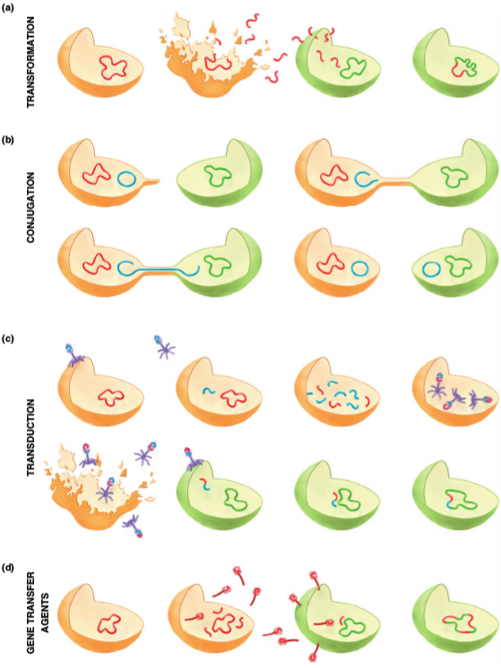
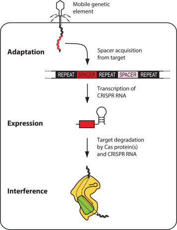
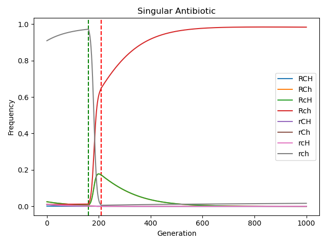
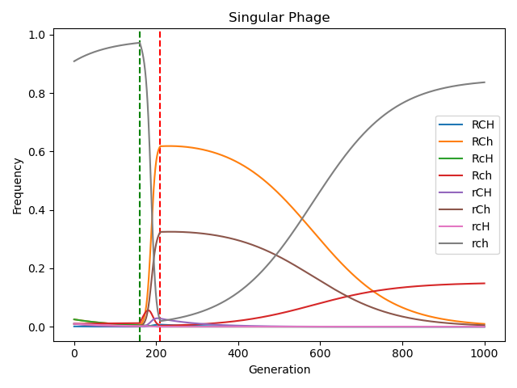
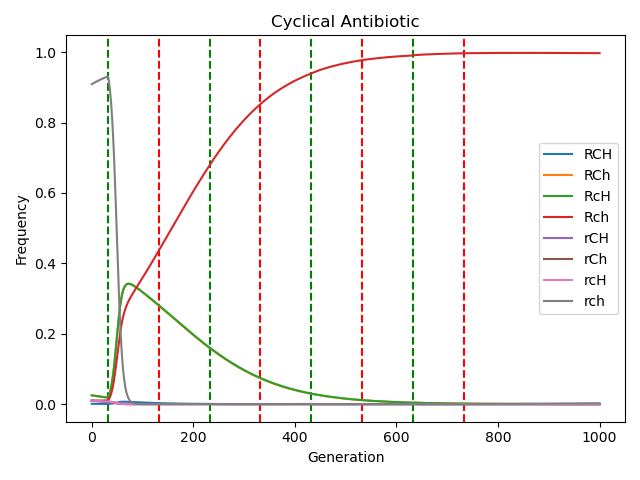
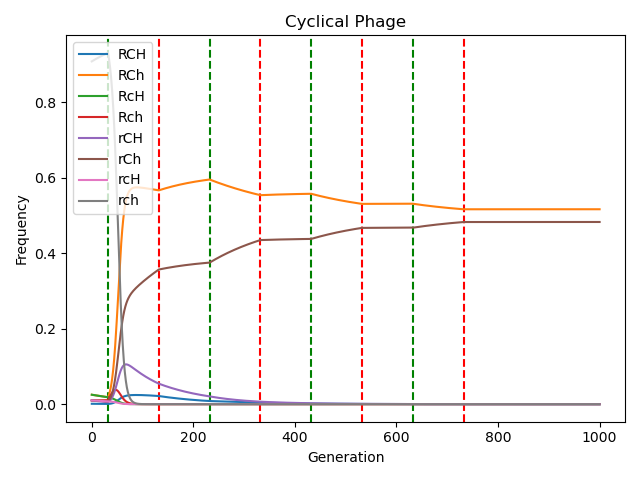
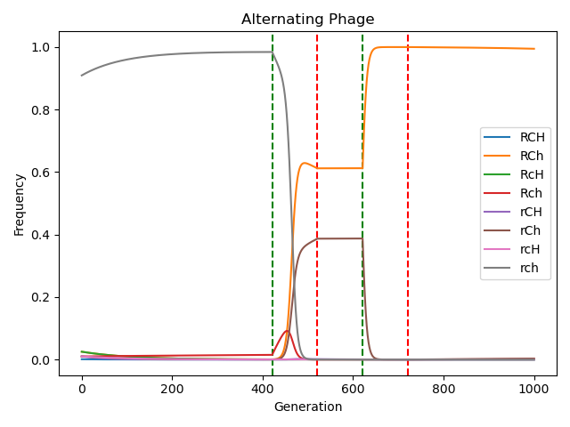
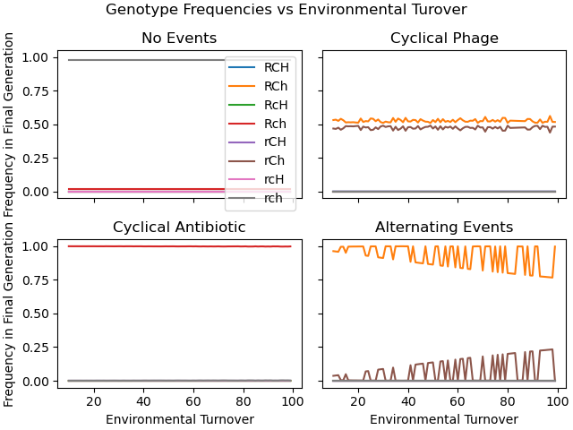

# Background

## Horizontal Gene Transfer (HGT)
:::: {.columns}
::: {.column width="50%"}
{height=200}
:::
::: {.column width="50%"}
- **Transformation:** Incorporation of free-floating DNA into the genome
- **Conjugation:** Transfer of DNA through cell-cell connections
- **Transduction:** Transfer of DNA via phage
:::
::::

## CRISPR-Cas In Bacteria
:::: {.columns}
::: {.column width="40%"}
{height=200}
:::
::: {.column width="60%"}
- Adaptive Bacterial Immune System
- Requires CRISPR array and Cas proteins
- Steps
  1. Exposure
  1. Spacer Acquisition
  1. Targeted degradation in next exposure
- Protects against "foreign" DNA, but can acquire __any__ DNA as a spacer
:::
::::

## Fitness Trade-offs
- HGT can help gain genes increase fitness in a specific environment faster than mutation
- CRISPR can block phage mediated HGT or uptake of environmental DNA
- HGT can result in genome disruption or gaining toxic gene products
- metabolic cost to maintain CRISPR or HGT machinery expression
- CRISPR systems can also be transferred between bacteria via plasmids

# Model

## Genotypes
\begin{table}
    \centering
    \begin{tabular}{@{}lll@{}}
        \toprule
        \multicolumn{2}{c}{Allele} & Description \\
        \cmidrule(l){1-2}
        Major & Minor & \\
        \midrule
        $R$ & $r$ & has/does not have resistance gene \\
        $H$ & $h$ & HGT machinery is expressed/not expressed  \\
        $C$ & $c$ & CRISPR-Cas is expressed/not expressed \\
        \bottomrule
    \end{tabular}
    \caption{Allele definitions}
\end{table}

## Basics
- Haploid population
- infinite population
- Each generation we have 1) gene transfer 2) mutation and 3) selection
  - no sexual reproduction, consider gene transfer step
  - Gene transfer is  analogous to oblique learning from Fogarty L. 2018
  - mutation is $r \to R$ or $R \to r$

## Environment Switching
:::: {.columns}
::: {.column width="40%"}
- We consider 3 different environments
  - $E_n$: Neutral, no threats
  - $E_b$: Bacteriophage, increased risk of phage contact
  - $E_a$: Antibiotic, increased risk of antibiotic contact
:::
::: {.column width="60%"}
- **Singular Threat:** Singular threat event (antibiotic dosage or phage outbreak)
- **Cyclical Threat:** Regular threat events every $2l$ generations, lasting $l$ generations.
- **Alternating Threat:** Same as Cyclical Threat model but switching between threats threats each event.
:::
::::

## Fitness
\begin{table}
    \centering
    $\begin{array}{llll}
    \toprule
    Genotype & \multicolumn{3}{c}{Environment} \\
    \cmidrule(r){2-4}
        & E_n & E_b & E_a \\
    \midrule
    RCH & 1-2s_m & (1+s_p)(1-2s_m) & (1+s_p)(1-2s_m) \\
    RCh & 1- s_m & (1+s_p)(1- s_m) & (1+s_p)(1- s_m) \\
    RcH & 1- s_m & 1- s_m          & (1+s_p)(1- s_m) \\
    Rch & 1      & 1               & 1+s_p           \\
    rCH & 1-2s_m & (1+s_p)(1-2s_m) & 1-2s_m          \\
    rCh & 1 -s_m & (1+s_p)(1- s_m) & 1-s_m           \\
    rcH & 1- s_m & 1- s_m          & 1-s_m           \\
    rch & 1      & 1               & 1               \\
    \bottomrule
    \end{array}$
    \caption{Relative fitness values for each genotype in each environment}
    \label{ft}
\end{table}
- $s_m$ reflects cost of maintaining HGT/CRISPR, $s_m << s_p$

## Genotype Frequencies
- $g$ represents each genotype
1. **Gene Transfer:** $x_g^t = x_g + \sum_{x_R} x_{\neg g}x_R h(x_{\neg g},x_R)$
   - if $g=RCH$ then $\neg g=rCH$, same for $CH,cH,Ch,ch$
   - defined for R genotypes ($x_R$), for r genotypes subtract the sum
   - $h()$ probability of transfer, increases for each $H$ allele ($g_h,g_H,2g_H$)
1. **Mutation:** $x_g^s = (1-\mu(g))x_g^t + \mu(g)x_{\neg g}^t$
   - $\mu(g)$ is $\mu_{r\to R}$ for r genotypes and$\mu_{R\to r}$ for R genotypes
1. **Selection:** $x_g' = \frac{x_g^sf(g)}{\bar{w}}$
   - $f(g)$ picks the correct fitness modifier from Table 2
   - average fitness $\bar{w} = \sum_g x_g^sf(g)$

# Results

## Single Antibiotic Event
\center
{height=275}

## Single Phage Event
\center
{height=275}

## Cyclical Antibiotic Events
\center
{height=275}

## Cyclical Phage Events
\center
{height=275}

## Alternating Events
\center
{height=275}

## Environmental Stability
\center
{height=275}

## Conclusion

### Conclusion
- resistance allele dominates even outside of antibiotic pressure
- environmental turnover rate significantly affects genotype frequencies

### Future Directions
  - explore parameter space and look for empirical justifications
  - model phage population dynamics directly
  - incorporate terms that reflect biological trade-off of HGT/CRISPR
